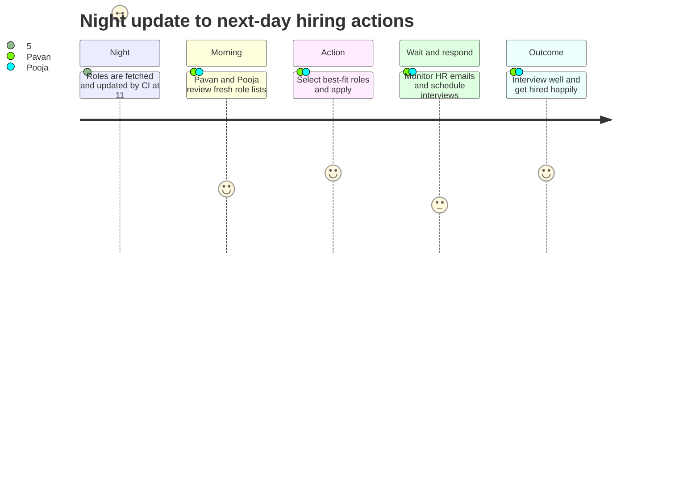
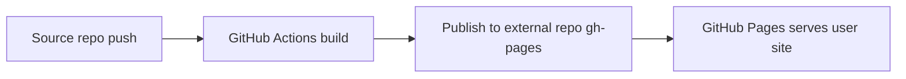

## Why this note exists

This note is a short operational log of how we got this website running end-to-end, with independent live-role tracking for both Pavan and Pooja.

Also: big credit to **Vitthal Mirji** (`vitthalmirji.com`) for architecture direction, review pressure, and practical guardrails.

## What we did

1. Bootstrapped Hugo with `ink-free` theme as submodule.
2. Added clean GitHub Pages deploy workflow.
3. Integrated `hugo-live-roles-kit-v0.1` in isolated package form.
4. Split live roles into two independent profiles and outputs.
5. Added shared About, Blog, Notes, and Playbook sections.
6. Added two independent menu entries:
   - Pavan roles
   - Pooja roles
7. Fixed Mermaid rendering across Playbook, posts, and notes at template level.
8. Updated deploy trigger paths so role data updates publish automatically.

## What mattered most

- Keep config boundaries strict.
- Keep profile intent editable by non-tech users.
- Keep CI boring and deterministic.
- Keep lifecycle policy explicit (21-day stale, 30-day inactive).
- Keep docs in sync with real behavior after every workflow change.

## Source integrations added now

- Added direct support for Adzuna, Jooble, Remotive, Jobicy (while keeping all earlier sources).
- Added SerpAPI-based smart query discovery to cover official sites and major boards.
- Added board coverage logic for LinkedIn, Indeed, XING, Naukri, StepStone.
- Added official careers page inputs and discovery fields in source registry YAML.

Main keys to add in GitHub secrets:

- `SERPAPI_API_KEY`
- `ADZUNA_APP_ID`
- `ADZUNA_APP_KEY`
- `JOOBLE_API_KEY`

All non-secret runtime values moved to:

- `roles-kit/providers.runtime.yml`

Performance safety added:

- Provider calls are key-aware and auto-skip when keys are absent.
- Discovery-heavy official-site crawling is feature-gated.
- Query and concurrency caps are controlled from YAML knobs.

## Hiring flow we now follow daily



## Commands we used repeatedly

```bash
npm run roles:check
npm run fetch:roles
npm run build:hugo
```

This command set validated profile config, refreshed role data, and checked final site build.

## Hosting model we finalized

We intentionally kept source and hosting separate:

- Source repo: this project repo.
- Hosting repo: `<username>.github.io` (GitHub user-site repo).



Critical setup points:

1. Target repo name must be exactly `<username>.github.io`.
2. Target repo Pages source must be `gh-pages` branch and `/(root)`.
3. Use PAT or deploy key for cross-repo publish.
4. Build with production `baseURL` as `https://<username>.github.io/`.
5. Detailed non-tech steps are in the Playbook: .

## Thanks

Thanks, Vitthal, for pushing this toward “clear and boring” instead of “smart but fragile”. That made the final setup much better.
