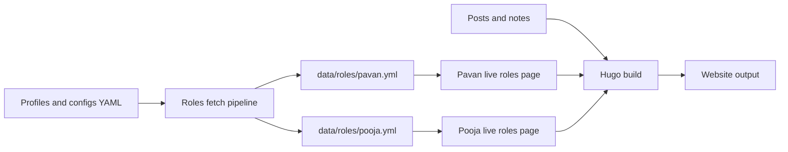
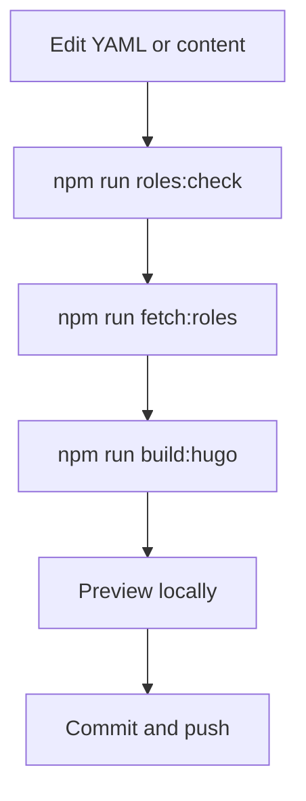
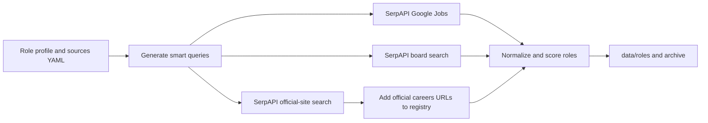
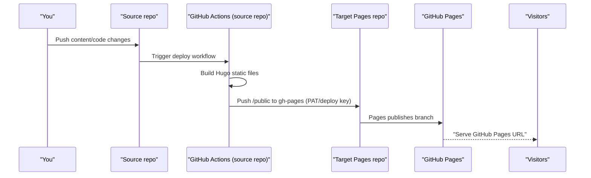
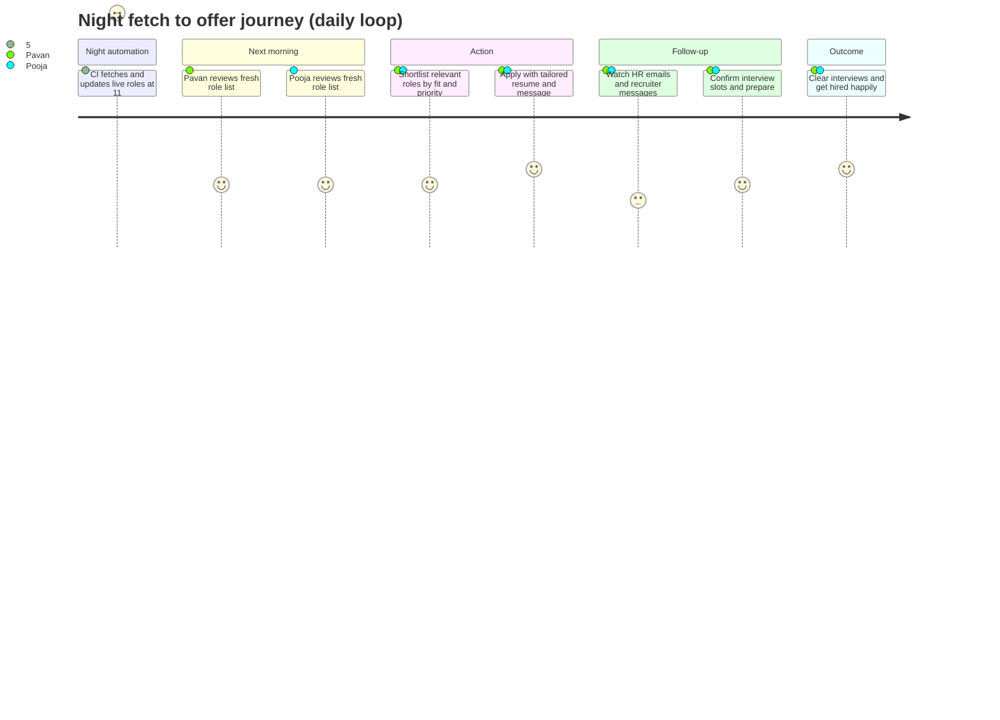
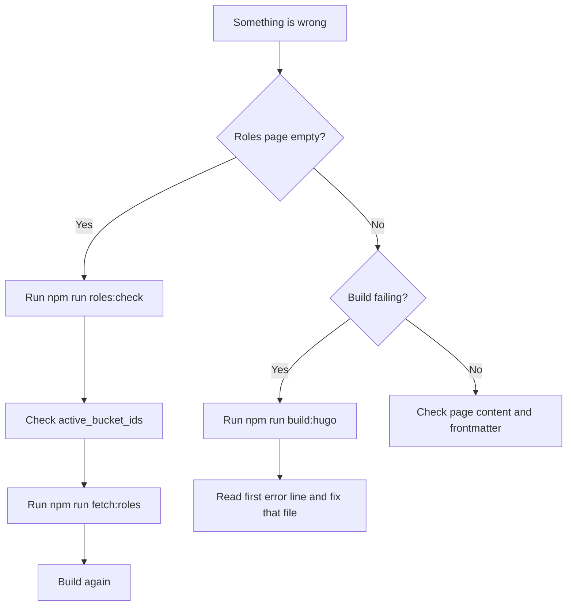

# Website playbook

This is the operating manual for this website.

It is written for non-tech users in simple English.

## Why this playbook exists

This website has two goals at the same time:

1. Shared publishing for both people (posts, notes, about, playbook).
2. Independent live roles tracking for each person.

If this is not clearly managed, things get mixed.
This playbook keeps it clean, predictable, and easy.

## How to read this page

Use this in order when you are new:

1. Start with “Quick start in 10 minutes”.
2. Read “Live roles model” to understand what is shared and separate.
3. Use “Common changes” when you want to update roles.
4. Use “Troubleshooting flow” only when something fails.

Use this section directly if you are in a hurry:

- “Command cheat sheet”
- “Current role focus”

## What this website contains

| Area             | Shared or separate | Main path                     |
|------------------|--------------------|-------------------------------|
| Home             | Shared             | `content/_index.md`           |
| About            | Shared             | `content/about.md`            |
| Blog posts       | Shared             | `content/posts/`              |
| Notes            | Shared             | `content/notes/`              |
| Playbook         | Shared             | `content/playbook/_index.md`  |
| Pavan live roles | Separate           | `content/live-roles/pavan.md` |
| Pooja live roles | Separate           | `content/live-roles/pooja.md` |

## System view (simple)



## Quick start in 10 minutes

### Step 1: validate roles setup

```bash
npm run roles:check
```

### Step 2: fetch latest roles

```bash
npm run fetch:roles
```

### Step 3: build website

```bash
npm run build:hugo
```

### Step 4: run local preview

```bash
npm run dev
```

Local preview opens on `http://localhost:1313/`.

## Command cheat sheet

| Command               | What it does                                | When to use                 |
|-----------------------|---------------------------------------------|-----------------------------|
| `npm run roles:check` | Validates roles config/profile/source files | Before any role change      |
| `npm run fetch:roles` | Pulls live roles for both people            | Daily or after config edits |
| `npm run build:hugo`  | Builds final site                           | Before pushing changes      |
| `npm run dev`         | Starts local preview server                 | While editing content       |

## Live roles model

### Shared files

- Roles engine code: `packages/hugo-live-roles-kit-v0.1/src/`
- Hugo roles shortcode: `layouts/shortcodes/live-roles.html`
- CI workflows: `.github/workflows/`

### Separate files

| Person | Config                                     | Profile                        | Sources                                     | Output                 |
|--------|--------------------------------------------|--------------------------------|---------------------------------------------|------------------------|
| Pavan  | `roles-kit/configs/pavan.roles.config.yml` | `roles-kit/profiles/pavan.yml` | `roles-kit/sources/pavan.roles-sources.yml` | `data/roles/pavan.yml` |
| Pooja  | `roles-kit/configs/pooja.roles.config.yml` | `roles-kit/profiles/pooja.yml` | `roles-kit/sources/pooja.roles-sources.yml` | `data/roles/pooja.yml` |

## Current role focus

### Pooja (active now)

- Product Manager
- Scrum Master / Agile roles
- Program Manager

Active bucket ids in `roles-kit/profiles/pooja.yml`:

```yml
active_bucket_ids: [ pm_product, scrum_agile, program_management ]
```

### Pavan (active now)

- Marketing Manager / Brand Marketing
- Digital Marketing / Performance Marketing
- Video Editing / Motion Content

Active bucket ids in `roles-kit/profiles/pavan.yml`:

```yml
active_bucket_ids: [ marketing_general, digital_marketing, video_editing ]
```

## Common changes (no coding)

## 1) Change countries and cities

Edit the profile file.

```yml
locations:
  countries: [ germany, india ]
  cities: [ berlin, munich, bengaluru, mumbai ]
  priority_countries: [ germany, india ]
  priority_cities: [ berlin, bengaluru ]
  exclude_countries: [ ]
  exclude_cities: [ ]
```

Then run:

```bash
npm run fetch:roles
```

## 2) Change role focus quickly

Use only `active_bucket_ids`.

Example for Pooja only PM + Program:

```yml
active_bucket_ids: [ pm_product, program_management ]
```

Example for Pavan only video editing:

```yml
active_bucket_ids: [ video_editing ]
```

Then run:

```bash
npm run fetch:roles
```

## 3) Add skill and keyword matching

Use these profile fields:

```yml
skills:
  - seo
  - performance marketing

keywords:
  must_have: [ ]
  nice_to_have: [ campaign strategy, analytics ]
  exclude: [ ]
```

## 4) Add or tune role titles

Inside each bucket:

```yml
buckets:
  - id: digital_marketing
    include_title_keywords: [ digital marketing manager, seo specialist ]
    include_text_keywords: [ google ads, meta ads, paid campaigns ]
```

## 5) Adjust freshness rules

Edit config file (`roles-kit/configs/*.roles.config.yml`):

```yml
knobs:
  stale_after_days: 21
  inactive_after_days: 30
  inactive_action: archive
```

Meaning:

- 21 days: marked stale.
- 30 days: moved to archive (or deleted if `hard_delete`).

## Editing model for non-tech users

| If you want to change | Edit this file                                 | Field                                 |
|-----------------------|------------------------------------------------|---------------------------------------|
| Countries/cities      | `roles-kit/profiles/<person>.yml`              | `locations.*`                         |
| Skill relevance       | `roles-kit/profiles/<person>.yml`              | `skills`                              |
| Role type focus       | `roles-kit/profiles/<person>.yml`              | `active_bucket_ids`                   |
| Title matching        | `roles-kit/profiles/<person>.yml`              | `include_title_keywords`              |
| Keyword matching      | `roles-kit/profiles/<person>.yml`              | `keywords.*`, `include_text_keywords` |
| Source list           | `roles-kit/sources/<person>.roles-sources.yml` | `explicit.*`                          |
| Freshness logic       | `roles-kit/configs/<person>.roles.config.yml`  | `knobs.*`                             |

## Daily workflow



## CI/CD workflow

| Workflow          | File                               | Trigger                                                                                        | Output                                           |
|-------------------|------------------------------------|------------------------------------------------------------------------------------------------|--------------------------------------------------|
| Deploy site       | `.github/workflows/deploy.yml`     | Push to `main` for `content/`, `layouts/`, `data/`, `roles-kit/`, `themes/`, config, or manual | GitHub Pages                                     |
| Update live roles | `.github/workflows/live-roles.yml` | Daily at 11:00 PM IST (`30 17 * * *`) + manual                                                 | Updated `data/roles/*.yml` and source registries |

## Live roles integrations and API keys

### Integrated providers

- Direct: Greenhouse, Lever, Personio, SmartRecruiters, Teamtailor, Recruitee, Ashby, StepStone feeds, Arbeitnow, Remotive, Jobicy, Adzuna, Jooble.
- Query-driven: SerpAPI Google Jobs + Google search discovery.
- Boards covered through smart queries: LinkedIn, Indeed, XING, Naukri, StepStone and other board links.
- Official company sites: direct `official_career_pages` plus auto-discovered careers URLs.

### Performance guardrails (built in)

- Key-aware execution: if a key is missing (`SERPAPI_API_KEY`, `ADZUNA_*`, `JOOBLE_API_KEY`), that provider is skipped automatically.
- Feature-gated discovery: expensive official-site crawling runs only when `serpapi_official_sites_search_enabled: true`.
- Query caps: `knobs.max_serpapi_queries_per_run` limits search fan-out.
- Concurrency caps: `knobs.max_concurrency` and `knobs.request_timeout_ms` keep runs predictable in CI.

### Secrets to add in GitHub

Add these in `Settings -> Secrets and variables -> Actions`.

| Secret name | Why it is needed |
| --- | --- |
| `SERPAPI_API_KEY` | Enables Google Jobs and smart board/official-site query discovery. |
| `ADZUNA_APP_ID` | Enables Adzuna API integration. |
| `ADZUNA_APP_KEY` | Enables Adzuna API integration. |
| `JOOBLE_API_KEY` | Enables Jooble API integration. |

### Where to get API keys

- SerpAPI key: https://serpapi.com/manage-api-key
- Adzuna developer keys: https://developer.adzuna.com/
- Jooble API key: https://jooble.org/api/about

### Non-secret settings file

Put all non-sensitive settings in `roles-kit/providers.runtime.yml`:

- query locale (`serpapi_gl`, `serpapi_hl`)
- country lists (`adzuna_countries`, `jooble_countries`)
- optional extra feeds/slugs/queries (`extra_sources.*`)

### Discovery flow (smart + official)



## Hosting with fixed target repo

This setup uses one fixed source repo and one fixed hosting repo.

Fixed repos:

- Source repo: `pavanshandilya/pavanshandilya.com`
- Hosting repo: `pavanshandilya/pavanshandilya.github.io`
- Published URL: `https://pavanshandilya.github.io/`

### Repos in this model

| Purpose                      | Repository                        |
|------------------------------|-----------------------------------|
| Source code (this Hugo repo) | `<username>/<source-repo>`        |
| Public hosting target        | `pavanshandilya/pavanshandilya.github.io` |

### End-to-end flow



### Step-by-step setup

1. Keep target repo as public: `pavanshandilya/pavanshandilya.github.io`.
2. In target repo, open `Settings -> Pages`.
3. Under Build and deployment, set:
    - Source: `Deploy from a branch`
    - Branch: `gh-pages`
    - Folder: `/(root)`
4. In source repo, choose cross-repo auth method:
    - Recommended: fine-grained PAT with `Contents: Read and write` for target repo
    - Alternative: deploy key with write access on target repo
5. Add secret in source repo:
    - `PERSONAL_TOKEN` (PAT with `Contents: Read and write` on `pavanshandilya/pavanshandilya.github.io`)
6. Run workflow manually once, then push a small content change to verify automatic deploy.
7. Confirm site at `https://pavanshandilya.github.io/`.

### Example workflow snippet (source repo)

```yml
name: deploy-to-user-site
on:
  push:
    branches: [ main ]
  workflow_dispatch: { }

jobs:
  deploy:
    runs-on: ubuntu-latest
    permissions:
      contents: read
    steps:
      - uses: actions/checkout@v4
      - uses: peaceiris/actions-hugo@v3
        with:
          hugo-version: '0.155.2'
          extended: true
      - run: hugo --minify --gc --baseURL "https://pavanshandilya.github.io/"
      - uses: peaceiris/actions-gh-pages@v3
        with:
          personal_token: ${{ secrets.PERSONAL_TOKEN }}
          external_repository: pavanshandilya/pavanshandilya.github.io
          publish_branch: gh-pages
          publish_dir: ./public
```

### Critical notes

- `GITHUB_TOKEN` from source repo cannot push to external repo.
- Use PAT or deploy key for cross-repo publish.
- Keep `baseURL` as `https://pavanshandilya.github.io/` for user-site Pages.

### Official references

- GitHub Pages types and naming
  rules: https://docs.github.com/en/pages/getting-started-with-github-pages/what-is-github-pages
- Publishing source settings (branch +
  folder): https://docs.github.com/en/pages/getting-started-with-github-pages/configuring-a-publishing-source-for-your-github-pages-site
- User/org site creation rule (`<owner>.github.io`): https://docs.github.com/articles/creating-project-pages-manually
- Custom workflows for
  Pages: https://docs.github.com/en/pages/getting-started-with-github-pages/using-custom-workflows-with-github-pages
- External repository deploy with `peaceiris/actions-gh-pages`: https://github.com/peaceiris/actions-gh-pages
- PAT creation
  guidance: https://docs.github.com/en/authentication/keeping-your-account-and-data-secure/creating-a-personal-access-token

## Daily hiring journey

This is the practical loop we follow every day.



## Troubleshooting flow



## Safety rules

1. Always run `npm run roles:check` before fetch.
2. Change YAML first, code later.
3. Keep changes small and test after each change.
4. Do not edit generated output manually in `data/roles/*.yml`.
5. Prefer `archive` over `hard_delete` unless you truly want permanent removal.

## Writing and publishing rules

Use these simple rules for posts and notes:

1. Start with the problem (WHY), then method (HOW), then details (WHAT).
2. Use sentence case headings.
3. Keep language direct and conversational.
4. Keep code examples short and explain what they do.

## About page and social links

Social links are configured in `hugo.toml`.

- Theme links: `[[params.social]]`
- About page social card: `params.socialLinks`
- Shortcode file: `layouts/shortcodes/social-kit.html`

## Final checklist before pushing

- [ ] `npm run roles:check` passed
- [ ] `npm run fetch:roles` passed
- [ ] `npm run build:hugo` passed
- [ ] Role pages show expected buckets
- [ ] No accidental edits in unrelated files

## One-page summary

This website is built to be boring and reliable:

- shared content,
- separate live roles,
- easy YAML customization,
- and automated daily updates.
