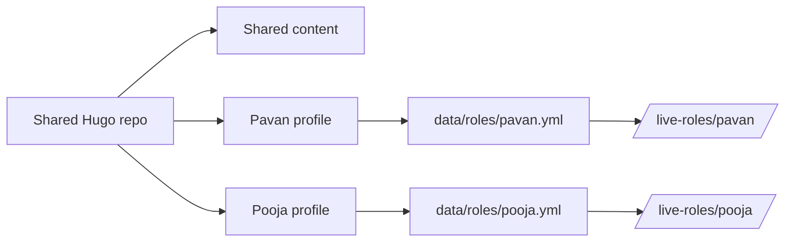
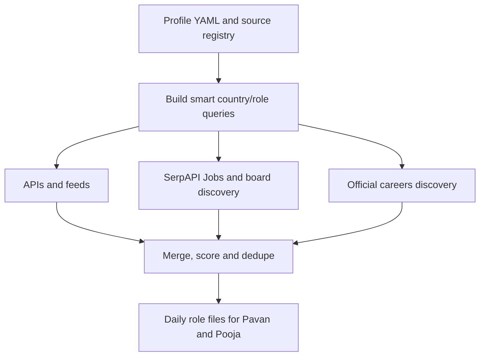
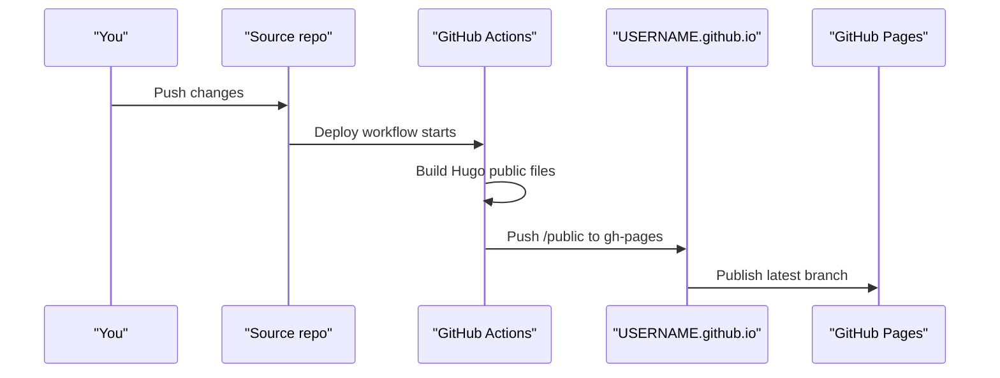
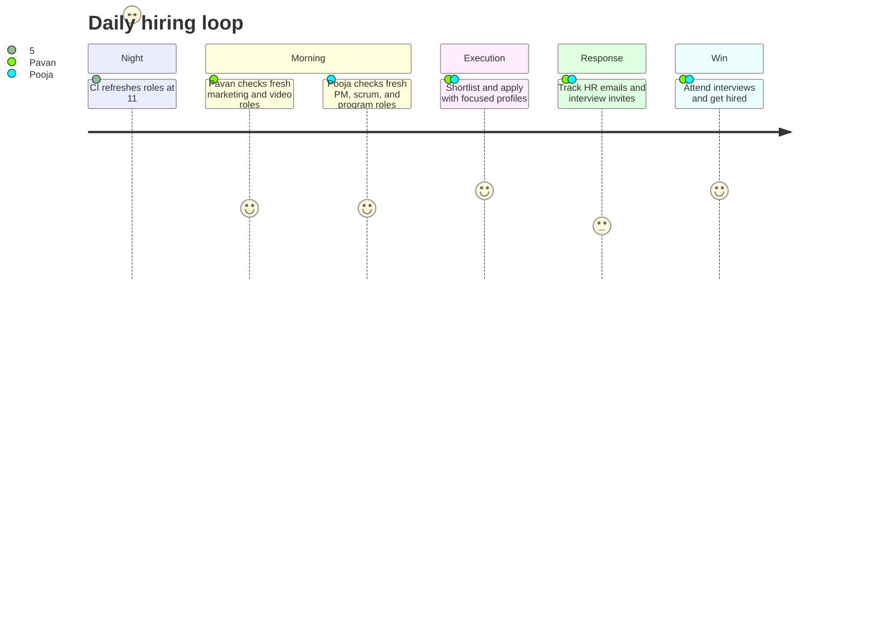

## Why we built this way

You know how this goes. Two people need one website, but not one life. Shared writing is fine. Shared notes are fine. But job search signals and role targets are personal. If we mix those, the system becomes noisy, confusing, and eventually useless.

So we built this with one simple principle: **shared content, isolated intent**.

- Shared: About, Blog, Notes, Playbook, deployment.
- Isolated: live-role profiles, source registries, output files, menu entry points.

That gave us three wins immediately:

1. Clean ownership boundaries between Pavan and Pooja.
2. One boring CI/CD system to maintain.
3. Non-tech operation through config changes instead of code edits.

## How the system is designed

### One repo, two live-role profiles

The site uses a portable package: `hugo-live-roles-kit-v0.1`.

Each person has independent config and data:

- Pavan config: `roles-kit/configs/pavan.roles.config.yml`
- Pooja config: `roles-kit/configs/pooja.roles.config.yml`
- Pavan output: `data/roles/pavan.yml`
- Pooja output: `data/roles/pooja.yml`

The mental model is simple:



This diagram shows isolation at the data/output layer while keeping one publishing pipeline.

### Role focus can change without code changes

Both profiles support `active_bucket_ids`.

That means role intent can switch by editing YAML only.

```yml
active_bucket_ids: [marketing_general, digital_marketing, video_editing]
```

This setting activates only those buckets for that profile run.

Current defaults:

- Pavan: marketing, digital marketing, video editing
- Pooja: product manager, scrum/agile, program manager

### Boring, explicit lifecycle rules

We intentionally chose explicit lifecycle policies:

- stale after 21 days
- inactive after 30 days
- inactive action: `archive` (or `hard_delete`)

That keeps old data from polluting current decisions without losing history abruptly.



- stale after: 21 days
- inactive after: 30 days
- inactive action: archive



### CI/CD behavior

We split CI into two boring workflows:

1. `deploy.yml` for Hugo build + GitHub Pages publish
2. `live-roles.yml` for daily role refresh at 11:00 PM IST (both profiles)

```bash
npm run roles:check
npm run fetch:roles
npm run build:hugo
```

These commands are the local equivalent of what CI does.

### Live roles data sources now integrated

The pipeline is now compatible with:

- Direct APIs/feeds: Greenhouse, Lever, Personio, SmartRecruiters, Teamtailor, Recruitee, Ashby, StepStone feeds, Arbeitnow, Remotive, Jobicy, Adzuna, Jooble.
- Query-driven discovery: SerpAPI Google Jobs + Google organic search.
- Board coverage through query discovery: LinkedIn, Indeed, XING, Naukri, StepStone and other boards.
- Official websites: manual careers URLs plus auto-discovered careers pages.



Keys needed for full coverage: `SERPAPI_API_KEY`, `ADZUNA_APP_ID`, `ADZUNA_APP_KEY`, `JOOBLE_API_KEY`.

Non-sensitive provider settings are now in repo file:

- `roles-kit/providers.runtime.yml`

Performance behavior:

- Missing keys auto-disable those providers.
- Official-site crawling runs only when the related flag is enabled.
- Query volume is capped by config so CI stays stable.

### Hosting model: source repo separate from user-site repo

This project uses a two-repo publish model:

- Source code lives in a normal repo (this one).
- Public website is published from `<username>.github.io` via `gh-pages` branch.



Key setup points:

1. Target repo must be named exactly `<username>.github.io`.
2. In target repo Pages settings, publish from `gh-pages` and `/(root)`.
3. Cross-repo push needs PAT or deploy key; source repo `GITHUB_TOKEN` is not enough.
4. Build with `https://<username>.github.io/` as production `baseURL`.
5. Full walkthrough is in the Playbook: .

### Real daily loop from data to hiring



## What this means in day-to-day use

### For Pavan and Pooja

- You both write in the same `posts` and `notes` sections.
- You each keep independent role targets and source registries.
- You can switch role direction quickly (for example PM to EM) with one config edit.

### For future maintainers

- No hidden magic.
- No hardcoded personal assumptions in templates.
- No need to touch TypeScript for normal operations.

### Content structure we now follow

We use leaf bundles by default for posts:

- `content/posts/<slug>/index.md`

This keeps media and content together and is cleaner for long-term maintenance.

## Quick links

- Playbook: 
- Pavan roles: 
- Pooja roles: 
- Notes: 

## Closing note

This setup is intentionally not flashy. It is designed to survive real life: changing priorities, shared ownership, and limited time.

If a system has to be used daily, boring is a feature.
